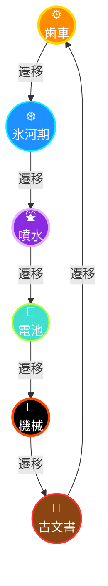

# Cross Realm - Omega Singularity -

スチームパンク、幻想世界、サイバーパンクという3つの異なる世界観（レルム）が交差する、オンライン・タクティカル・カードゲームです。
洗練されたネオンとホログラム、そして完全CSS+SVGで表現された美麗なUIで、PC・スマホを問わずブラウザ上で白熱したリアルタイム対戦を楽しめます。

## ⚡ 起動・クイックスタート

本プロジェクトは **Vite + React** 構成に移行しました。プレイするにはバックエンドとフロントエンドの両方を起動する必要があります。

1.  **依存関係のインストール** (初回のみ):
    ```bash
    npm install
    ```
2.  **バックエンドサーバーの起動**:
    ```bash
    node index.js
    ```
3.  **フロントエンドの開発サーバー起動**:
    ```bash
    npm run dev
    ```
4.  **アクセス**: ブラウザで `http://localhost:5173` にアクセスします。

### 操作方法
- **プレイヤー名**: 自分の名前を入力します（最大10文字）。
- **ルームID**: 対戦相手と同じ合言葉（ID）を入力して「接続開始」を押します。
- **ゲーム開始**: ルームに入場し、全員（CPU含む）が揃ったら、ホスト（一番最初に入室し「HOST」バッジがついているプレイヤー）が「ゲーム開始」を押してミッションをスタートします。
  - ※「CPU追加」ボタンで、Bot（X-TREME, A.L.I.C.E, G.E.A.R, N.U.L.L）を参戦させることも可能です。
- **サウンド**: 右上の「🔊/🔇」ボタンでいつでもSE（効果音）のオン/オフが可能です。

## 🌀 基本ルール

手札を最も早く **0枚** にしたプレイヤーが「MISSION CLEAR（勝利）」となります。
本ゲームは全5回のマッチで構成される「シリーズ戦」となっており、最終的な合計スコアでチャンピオンを決定します。

- **初期手札**: 5枚
- **システムオーバーロード（バースト）**: 手札が **11枚以上** になった瞬間、そのプレイヤーは脱落となり、スコアに **-10ポイント** のペナルティが課せられます。
- **ドロー**: 出せるカードがない場合は「ドロー」ボタンで1枚引きます。
- **スコア計算**: 勝利したプレイヤーは、その時点で他のプレイヤーが持っていた手札の合計枚数分のポイントを獲得します。

## 🔄 タクティカル・ペア・システム（属性の出し方）

場に出ているカードの「属性（レルム）」によって、次に出せるカードが厳密に制限されます。
属性は大きく3つのグループ（A, B, C）に分かれており、「維持」と「遷移」を繰り返してゲームが進行します。

### 属性の循環サイクル



### グループと遷移の役割

| グループ | 場の属性 | 次に出せる属性 | 役割（世界観） |
| :--- | :--- | :--- | :--- |
| **A** | ⚙️ 歯車 (GEAR) | 歯車 または 氷河期 | 【維持】スチームパンク |
| **A→B** | ❄️ 氷河期 (ICEAGE) | 噴水 または 電池 | 【遷移】幻想世界へのゲート |
| **B** | ⛲ 噴水 (FOUNTAIN) | 噴水 または 電池 | 【維持】幻想世界 |
| **B→C** | 🔋 電池 (BATTERY) | 機械 または 古文書 | 【遷移】サイバーパンクへのゲート |
| **C** | 🤖 機械 (MACHINE) | 機械 または 古文書 | 【維持】サイバーパンク |
| **C→A** | 📖 古文書 (ARCHIVE) | 歯車 または 氷河期 | 【遷移】スチームパンクへの帰還 |

> [!IMPORTANT]
> **【超重要】**: 「遷移」の役割を持つカード（氷河期・電池・古文書）は、同じカードを連続して重ねることはできません。必ず次の世界観へのゲートとなります。

## ✨ 特殊カード (Special) と ワイルドカード (Wild)

カードの左上に「S」のバッジがついているカードは、場に強力な干渉を行います。

### ⚔️ 攻撃・妨害系 (Special)

- **⚙️ 歯車 (S) [+2 DRAW]**
  - 次のプレイヤーに **+2枚ドロー** のペナルティを与えます。
  - 攻撃を受けたプレイヤーは、手札に「歯車(S)」があればそれを重ねて（+4, +6...と）回避・上乗せが可能です。それ以外のカードは出せません。

- **🤖 機械 (S) [REVERSE]**
  - 手番の進行方向（時計回り ↔ 反時計回り）を **反転** させます。
  - *※2人プレイ時の特例*: 2人対戦時に出した場合は、相手をスキップして **連続で自分のターン** になります。

### 🌈 属性変化系 (Wild)

- **⛲ 噴水 (S) [限定 WILD]**
  - 魔法の泉が溢れ出し、出す時に **好きな属性に変更** できます。
  - ただし、出せる条件は **「場が氷河期、または噴水」** の時に限定されます。

- **🪐 惑星 (PLANET) / 🏛️ 廃墟 (RUINS) [純粋 WILD]**
  - 場の属性が何であっても、いつでも（ドロー攻撃中以外）出せます。
  - 出した瞬間に、場を好きな属性に塗り替えることができます。
  - **WILDボーナス**: 惑星または廃墟を「あがり（最後の1枚）」として出した場合、そのマッチで獲得できるスコアが **1.5倍** にアップします。

## 🃏 デッキ構成（戦略的固定51枚）

運要素を抑え、カウンティングによる戦略性を高めるため、デッキ枚数は以下の通り固定されています。

### メイン属性（各10枚）
- **⚙️ 歯車 (GEAR)**: 通常7枚 / 特殊(S) 3枚
- **🤖 機械 (MACHINE)**: 通常7枚 / 特殊(S) 3枚
- **⛲ 噴水 (FOUNTAIN)**: 通常7枚 / 特殊(S) 3枚

### サブ・遷移属性（各5枚）
- **❄️ 氷河期 (ICEAGE)**: 5枚
- **🔋 電池 (BATTERY)**: 5枚
- **📖 古文書 (ARCHIVE)**: 5枚

### 純粋ワイルド（各3枚）
- **🪐 惑星 (PLANET)**: 3枚
- **🏛️ 廃墟 (RUINS)**: 3枚

## 🎮 開発・技術仕様

- **フロントエンド**: React 18, Vite, Tailwind CSS (Vanilla CSS 移行中)
- **バックエンド**: Node.js, Express, Socket.io
- **アーキテクチャ**:
  - `index.html` モノリスから **Vite + React** モジュラー構成へリファクタリング済み。
  - ロジックは `src/App.jsx`、スタイルは `src/index.css` に分離され、メンテナンス性が向上しています。
- **UI/UXデザイン**:
  - 画像アセットを使用せず、純粋なCSSグラデーションとSVGのみでサイバー・スチーム・ファンタジーの三位一体を表現（100dvh対応でモバイル完全最適化）。
  - 現在の属性と次に出せる属性を視覚的にガイドする「凡例バー」および「サイクル図（Tactical Cycle Wheel）」を実装。
  - 特殊カード使用時に画面揺れ（Screen Shake）、フラッシュ、カットイン演出などのダイナミックな視覚効果を搭載（v133.0 REFINED LAYOUT）。

## ⚖️ 免責事項・権利表記

- 本プロジェクトは、個人による非営利のファン活動として制作されたものです。
- **オマージュ元**: 株式会社バンダイナムコエンターテインメント様のタイトル『テイルズ オブ エターニア』内のミニゲーム「ウィス（WHISS）」のプレイフィールをリスペクトし、モチーフとしています。
- **権利について**: ゲームシステム設計、プログラムコード、およびUIデザイン/アセットの著作権は制作者に帰属します。モチーフとなった作品自体の著作権等は、各権利者様に帰属します。
